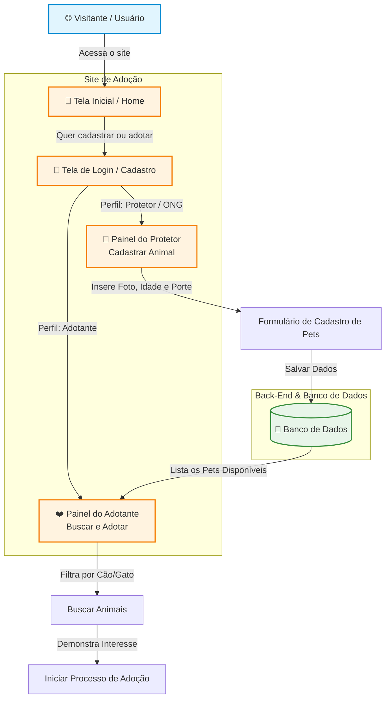

# TCC 2026 — [Nome do Grupo]
**LTP3 + QP3 · CEMIC 2026 · Prof. Rafael Martins Alves**
           
---
   
## 👥 Integrantes        

# TCC 2026 - [Nome do Grupo]
**LTP3 + QP3 · CEMIC 2026 · Prof. Rafael**

---

## 📝 Descrição do Projeto

Nosso projeto consiste no desenvolvimento de um site dedicado à adoção de cães e gatos que necessitam de abrigo e proteção. Diante da falta de plataformas centralizadas e acessíveis para o resgate de animais de rua ou abandonados, criamos este sistema para facilitar o processo de acolhimento. O site atua em duas frentes principais: permite que protetores cadastrem animais que precisam de um lar (informando dados como foto, porte e idade) e possibilita que novos tutores naveguem pela plataforma, filtrem as buscas e iniciem o processo de adoção com segurança.

---

## 👥 Integrantes

| Nome completo | GitHub | Turma |
| :--- | :--- | :--- |
| Vitória Santana | @usuario_vitoria | [3b] |
| Sofia Abarno | @usuario_sofia | [3b] |
| Maíra Gomes | @usuario_maira | [3b] |
| Letícia Krixi | @leticiakrixis | [3b] |
| Letícia Silva | @usuario_leticia_s | [3b] |

---

## 🏗️ Diagrama de Arquitetura do Sistema



---

## 🚀 Como Executar o Projeto

### 1. Requisitos Prévios
Certifique-se de ter instalado em sua máquina:
* [Git](https://git-scm.com)
* [Node.js](https://nodejs.org) (ou a tecnologia utilizada no seu Back-end)

### 2. Passo a Passo
1. Clone o repositório do projeto:
   ```bash
   git clone https://github.com
   ```
2. Acesse a pasta do projeto:
   ```bash
   cd tcc-2026-3b-equipe06-adocao-pets
   ```
3. Instale as dependências necessárias:
   ```bash
   npm install
   ```
4. Execute o comando de inicialização para rodar localmente:
   ```bash
   npm start
   ```
